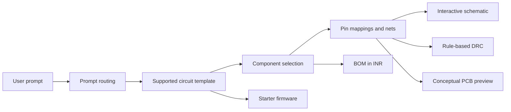

# AutoCircuit AI

AutoCircuit AI is a React and TypeScript prototype for converting a natural-language electronics requirement into a structured starting design. It connects the same generated design data across the schematic, pin mapping, DRC report, BOM, firmware, and conceptual PCB preview.

**Live demo:** https://auto-circuit-ai.vercel.app/  
**Repository:** https://github.com/mahadev-minajigi/AutoCircuitAI.git

## Project Goal

Early hardware design often requires switching between datasheets, pin tables, wiring notes, firmware, and parts lists. AutoCircuit AI demonstrates a beginner-friendly workflow that produces these outputs from one requirement and keeps them consistent for an initial prototype review.

This is an educational proof of concept, not a replacement for KiCad, Altium, SPICE, or a manufacturing-ready EDA flow.

## System Workflow



## Current Features

- Natural-language design prompt with a Quick Start weather-station preset
- Shared design model used by every result view
- Interactive schematic with visible power, ground, I2C, SPI, and other signal nets
- Fullscreen schematic mode with zoom, pan, and automatic recentering
- MCU-to-component pin mapping table
- Rule-based DRC checks for MCU selection, voltage compatibility, current demand, and I2C notes
- BOM with estimated costs displayed in Indian rupees (INR)
- CSV, JSON, and firmware export from the header
- Starter firmware examples for supported templates
- Design-specific conceptual PCB placement preview
- Responsive layout with page scrolling and mobile stacking

## Demo 1: IoT Weather Station

Use the Quick Start card or enter:

```text
Design a temperature, humidity and pressure monitoring system using ESP32, BME280 and OLED display.
```

The generated design contains:

- ESP32-WROOM-32
- BME280 environmental sensor
- SSD1306 OLED display
- 3.3V and common GND connections
- Shared I2C SDA and SCL connections
- Starter Arduino firmware
- BOM, DRC report, pin mapping, and PCB preview

## Demo 2: STM32 SPI Flight Controller

To test the separate SPI signal routes, enter:

```text
Design an STM32F405 flight controller using an MPU6000 6-axis IMU connected through SPI1.

Use:
- STM32F405 as the main MCU
- MPU6000 as the motion sensor
- 3.3V power
- Common GND

SPI1 connections:
- PA5 (SPI1_SCK) -> MPU6000 SCLK
- PA6 (SPI1_MISO) -> MPU6000 MISO
- PA7 (SPI1_MOSI) -> MPU6000 MOSI
- PA4 (SPI1_NSS/CS) -> MPU6000 CS
```

The schematic should show four separate SPI routes: SCK, MISO, MOSI, and CS. The STM32 example intentionally excludes an unused floating regulator block.

## How Prompt Routing Works

The current prototype uses deterministic template routing rather than a remote AI service:

- Prompts containing `stm32` or `drone` use the STM32F405 and MPU6000 template.
- Prompts containing `pico`, `rp2040`, or `synth` use the RP2040 audio template.
- Other prompts use the ESP32 weather-station template.
- Adding `motor` adds an L298N motor-driver component to the selected design.

This deterministic approach makes the first-review demo repeatable and easy to validate. A future version can replace keyword routing with an actual LLM and structured hardware schema validation.

## Project Structure

```text
src/
├── App.tsx                         Main workflow and tab navigation
├── components/
│   ├── PromptStudio.tsx             Prompt input and Quick Start
│   ├── SchematicViewer.tsx          React Flow circuit diagram
│   ├── PinoutTable.tsx              MCU-to-component mappings
│   ├── DrcReport.tsx                Rule-based electrical checks
│   ├── BomTable.tsx                 INR bill of materials
│   ├── CodeEditor.tsx               Starter firmware view
│   └── PcbViewer.tsx                Conceptual design-specific PCB preview
├── data/circuitTemplates.ts         Supported circuit templates
├── services/aiCircuitEngine.ts      Template routing and DRC generation
└── types/circuit.ts                 Shared TypeScript data model
```

## Tech Stack

- React 19
- TypeScript
- Vite
- React Flow
- Lucide React
- HTML Canvas for the conceptual PCB preview
- CSS responsive layout

## Run Locally

```bash
npm install
npm run dev
```

Open the Vite URL shown in the terminal. Generate a design, then inspect the Schematic, DRC Report, Pin Mapping, BOM, Firmware, and PCB Preview tabs.

## Build and Validate

```bash
npm run build
```

The production build runs TypeScript project checks followed by the Vite production bundle.

## Limitations

- The current generator uses local templates and keyword routing; it is not yet a general-purpose AI circuit synthesizer.
- DRC is rule-based and intentionally limited to prototype-level checks.
- The PCB view is a conceptual placement preview, not a real netlist, autorouter, Gerber generator, or manufacturing layout.
- Component prices are illustrative INR estimates, not live distributor prices.
- Pin mappings should be checked against the target board, module datasheet, voltage requirements, pull-ups, decoupling, and current limits before building hardware.

## Future Improvements

Planned improvements, in priority order:

1. **Structured AI generation:** connect an LLM backend that converts requirements into a validated circuit schema instead of keyword-based template selection.
2. **Datasheet-aware validation:** add verified pin, voltage, current, address, package, and interface constraints from component libraries and datasheets.
3. **Complete electrical rules:** validate unconnected pins, power trees, pull-ups, decoupling capacitors, level shifting, current margins, and conflicting bus addresses.
4. **Real schematic export:** export standards-based KiCad schematic/netlist files for continued engineering work.
5. **Manufacturing-ready PCB flow:** add footprint assignment, board constraints, real routing, design-rule checks, and Gerber/Drill export.
6. **Better design interaction:** support editable components, manual wire changes, undo/redo, and regeneration of only the affected subsystem.
7. **Testing and collaboration:** add automated fixture tests for prompt-to-template routing, visual regression tests, saved projects, authentication, and shareable design links.
8. **Live component sourcing:** connect distributor APIs for current INR pricing, stock, alternatives, and total-cost comparison.

## Project Status

This is a first-review prototype. Its strongest demonstrated flow is the ESP32 weather station, with the STM32/MPU6000 example serving as a secondary SPI validation case. The project prioritizes a clear, consistent end-to-end demonstration while documenting the engineering work still required for a professional EDA product.
